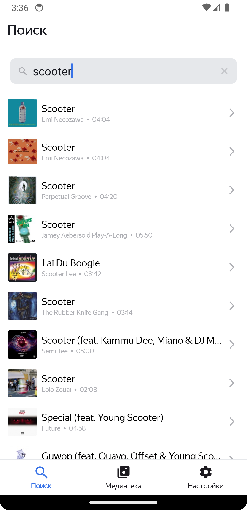

# Приложение для поиска и прослушивания музыки

## Основной функционал

- Поиск музыкальных треков через ITunesApi
- Прослушивание треков через проигрыватель
- Сохранение треков в “Избранное”
- Составление своих плейлистов

## Используемый стек

- MVVM
- Coroutines
- SQLite (Room)
- Retrofit
- Jetpack Navigation
- Koin
- Glide

## Скриншоты

